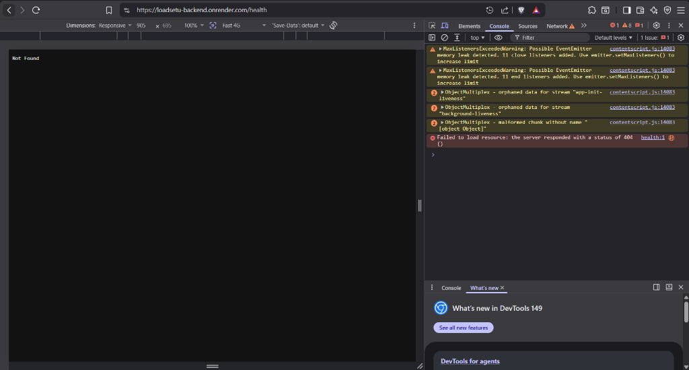
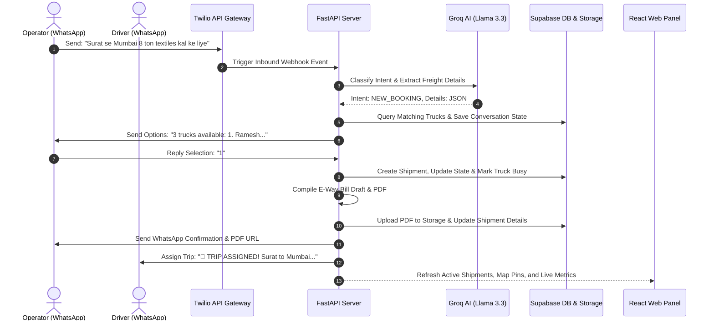

<p align="center">
  
</p>

# LoadSetu
### AI-Powered Agentic Freight Coordination for India's MSME Logistics
> **Hackathon Submission**: Far Away 2026 | **Theme**: Logistics & Transit

[](https://www.python.org/)
[](https://react.dev/)
[](https://fastapi.tiangolo.com/)
[-orange.svg)](https://console.groq.com/)
[-emerald.svg)](https://supabase.com/)
[](LICENSE)

---

## 🎯 The Opportunity & Problem

India's logistics sector accounts for **11–13% of GDP**—nearly double that of developed economies. This inefficiency stems from the fragmented trucking layer: India has over **12.5 million trucks** and **3.5 million operators**, **85% of whom manage fleets of 5–20 vehicles with zero digital tools**. 

### The Pain Points:
1. **App Fatigue**: Truck drivers and MSME operators rely on WhatsApp daily but refuse to download, register, or learn complex logistics apps.
2. **Coordination Chaos**: Bookings, vehicle matching, status updates, and paper-based Lorry Receipts are handled manually across fragmented, unstructured WhatsApp chats.
3. **High Intermediary Costs**: Local brokers extract **15–20% in transaction fees** purely for coordinating communication.
4. **Document Friction**: Generating official E-Way Bills (EWB), managing Lorry Receipts (LR), and gathering proof of delivery (POD) requires manual data entry and results in lost documents, payment delays, and unresolved disputes.

---

## 💡 The Solution: LoadSetu

**LoadSetu** is an agentic freight coordination platform that turns informal, natural-language conversations on WhatsApp into structured logistics workflows. It acts as an AI dispatch operator, connecting transporters, drivers, and operators without requiring them to download any app.

### 🌟 Key Innovation: WhatsApp as the OS
* **For Operators**: Book a truck simply by texting in Hinglish (e.g., *"Kal Surat se Mumbai 8 ton textiles"*). The AI extracts booking details, runs matching heuristics, presents available trucks, and generates a draft E-Way Bill PDF.
* **For Drivers**: Receive automated dispatch alerts and send quick status updates (*"loaded"*, *"transit"*, *"delivered"*).
* **For Dispatch Managers**: Monitor all active shipments, driver routes, and AI confidence parameters from a responsive, real-time web dashboard.

---

## 🏗️ Technical Architecture & Data Flow

<p align="center">
  
</p>

LoadSetu integrates a **FastAPI backend** (orchestrating AI agents and Twilio/Supabase integrations) with a **React + Vite frontend dashboard** providing real-time visibility.



---

## ⚙️ Core Agentic Workflows

1. **Stateful Hinglish NLP Intake**: Llama 3.3 (via Groq) acts as the **Intake Agent**, parsing casual Hinglish/Hindi, and extracting fields. Includes a **one-off repair prompt retry** for JSON parsing errors.
2. **Heuristic Vehicle Matching**: The **Matching Agent** matches cargo requirements and location to the truck registry using payload capability and origin corridor mapping, returning explicit matching reasons.
3. **Driver Lifecycle Orchestrator**: Manages driver trip acceptance (via WhatsApp commands), status changes, and implicit acceptance (e.g. driver typing *"loaded"* triggers status changes).
4. **Delay Risk Intelligence**: Background task periodically evaluates active shipments, calculating a risk score (0-100%) and level (Low, Medium, High, Critical) based on time elapsed without updates, scheduled pickup margins, and route distance.
5. **E-Way Bill & Dispute Pack PDF Generation**: The **Document Agent** compiles EWB drafts and complete dispute packets (consolidating timeline audits, driver details, and message histories) into verified, watermarked ReportLab PDFs.

---

## 🛡️ Production Security Hardening (Judge Highlights)

Unlike typical hackathon projects running in mock sandboxes, LoadSetu is hardened for real-world deployments:
* **Twilio Webhook Verification**: Rejects any inbound requests lacking a valid `X-Twilio-Signature` signature to prevent spoofing in production.
* **Webhook Idempotency**: Inspects Twilio's `MessageSid` to ensure duplicate webhook hits (due to retries or network drops) do not create duplicate bookings.
* **CORS Lockdown**: Wildcard CORS is replaced with specific origins (`ALLOWED_CORS_ORIGINS`) in production.
* **Strict Admin Authorization**: dashboard APIs require a bearer token (`ADMIN_TOKEN`) and reject default development credentials in production.
* **Fail-Loud Enforcement**: Automatically disables fallback mocks in production, raising `RuntimeError` on database or AI service connection failure.

---

## ⚙️ Environment Variables

### Backend Configuration (`backend/.env`)
Create a file named `.env` in the `backend/` directory.

| Variable | Description | Production Requirement | Default / Demo Placeholder |
| :--- | :--- | :--- | :--- |
| `TWILIO_ACCOUNT_SID` | Twilio Account SID | Required | `AC00000000000000000000000000000000` |
| `TWILIO_AUTH_TOKEN` | Twilio Auth Token | Required (enables signature checks) | `00000000000000000000000000000000` |
| `TWILIO_WHATSAPP_NUMBER` | Twilio WhatsApp number | Required | `whatsapp:+14155238886` |
| `GROQ_API_KEY` | Groq Developer API Key | Required (no mock LLM in prod) | `gsk_00000000000000000000000000000000` |
| `SUPABASE_URL` | Supabase Project Rest URL | Required (no mock DB in prod) | `https://dummy.supabase.co` |
| `SUPABASE_SERVICE_KEY` | Supabase Service Role Key | Required | `dummy_service_key` |
| `APP_ENV` | Running Environment | Set to `production` | `development` |
| `WEBHOOK_BASE_URL` | Registered public webhook URL | Required (Twilio signature check) | `http://localhost:8000` |
| `ADMIN_TOKEN` | Bearer Auth token for operators | Required (rejects default) | `secret_admin_token_2026` |
| `ALLOWED_CORS_ORIGINS` | CORS allowed domains | Required in production (comma-sep) | `http://localhost:5173` |
| `DELAY_CHECK_INTERVAL_HOURS`| Background delay check poll rate | Optional | `3` |

### Frontend Configuration (`frontend/.env`)
Create a file named `.env` in the `frontend/` directory.

```bash
# Vite Environment Configuration
VITE_API_BASE_URL=http://localhost:8000
VITE_ADMIN_TOKEN=your_secure_admin_token
```

---

## 🚀 Setup & Installation

### Backend Setup
1. Navigate to the backend directory and set up a Python virtual environment:
   ```bash
   cd backend
   python -m venv venv
   source venv/bin/activate  # On Windows: venv\Scripts\activate
   ```
2. Install the required packages:
   ```bash
   pip install -r requirements.txt
   ```
3. Seed the local DB/Mock storage with transporters, drivers, and initial shipments:
   ```bash
   python seed_demo.py
   ```
4. Start the FastAPI backend server:
   ```bash
   uvicorn main:app --reload
   ```

### Frontend Setup
1. Navigate to the frontend directory:
   ```bash
   cd ../frontend
   ```
2. Install npm packages:
   ```bash
   npm install
   ```
3. Start the Vite React development server:
   ```bash
   npm run dev
   ```
4. Open your browser and navigate to `http://localhost:5173`.

---

## 💬 Step-by-Step Demo Walkthrough

You can test the entire booking and coordination lifecycle locally using the **WhatsApp Webhook Simulator**, even without active API keys.

### Step 1: Start the simulator client
In a new terminal window, activate your backend virtualenv and run:
```bash
python backend/scratch/mock_webhook_client.py
```

### Step 2: Book a truck as Rajesh Patel (Operator)
1. Select option `1` in the simulator menu to chat as **Rajesh Patel** (`+919876543210`).
2. Input the message:
   ```text
   Surat se Mumbai 8 ton textiles kal ke liye
   ```
3. Look at the React dashboard (`/conversations` tab) or the simulator logs to see the AI agent's message displaying 3 truck options.

### Step 3: Confirm the selection
1. In the simulator, type `1` and press enter to select the first truck.
2. The agent will confirm the booking, register the shipment details, generate the **E-Way Bill Draft PDF**, notify the driver, and update the operator:
   * View the **React Dashboard** (`/` tab) to see the new shipment added with `CONFIRMED` status.
   * Inspect the EWB PDF generated locally under `/tmp` (or referenced in the conversation). Note the `"DRAFT — NOT A PORTAL-ISSUED EWB"` watermark across the pages.

### Step 4: Update trip status as Ramesh Kumar (Driver)
1. Select option `2` in the simulator to chat as **Ramesh Kumar** (`+919876543211`).
2. Type `loaded ho gaya` and press enter. The shipment status updates to `LOADED` on the dashboard.
3. Type `delivery complete` and press enter. The shipment status updates to `DELIVERED` and the truck returns to the available pool.

---

## 📡 API Routes Reference

All dashboard endpoints require authorization via `Authorization: Bearer <ADMIN_TOKEN>`.

### Webhook API
* `POST /webhook`: Webhook endpoint for Twilio incoming messages. Directs messages to conversational engine.

### Admin Dashboard APIs
* `GET /trucks`: Lists all trucks, drivers, home/current cities, and availability status.
* `GET /shipments`: Lists all shipments with joined operator and truck details.
* `GET /shipments/{id}/timeline`: Retrieves the chronological trust timeline / audit trail for a shipment.
* `GET /shipments/{id}/notifications`: Retrieves all WhatsApp notification attempts (including failed and retried logs) for a shipment.
* `POST /shipments/{id}/dispute-pack`: Generates a ReportLab PDF containing a verified dispute pack with audit logs and messages.
* `POST /shipments/{id}/cancel`: Cancels the shipment, releases the assigned truck, and notifies operator and driver.
* `POST /shipments/{id}/reassign`: Reassigns the shipment to another nearby available truck and prompts the new driver for acceptance.
* `GET /review-items`: Returns all open manual review items from the low-confidence AI extraction queue.
* `POST /review-items/{id}/resolve`: Resolves a manual review item.
* `POST /review-items/{id}/dismiss`: Dismisses a manual review item.

---

## 🗺️ Roadmap & Future Scope
* **GST Portal API Integration**: Directly register verified E-Way Bills and upload invoice payloads to the official NIC API.
* **Driver Route Tracking**: Integrate lightweight, permissioned WhatsApp location sharing to plot transit coordinates on the dashboard map without standalone apps.
* **Unified Payments**: Facilitate fast digital payments for drivers and transporters (UPI-based) linked directly to POD verification events.