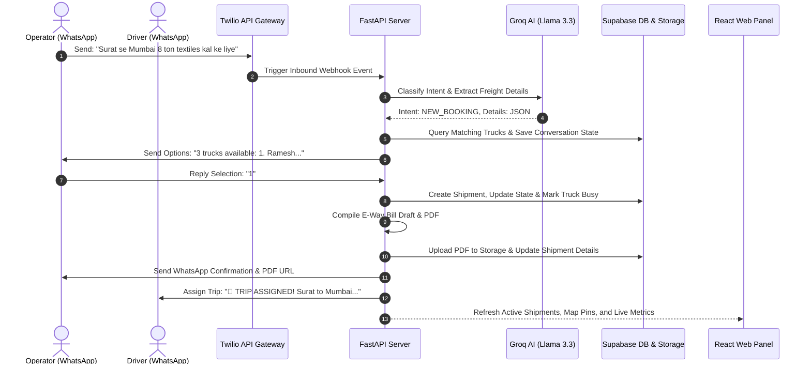

# LoadSetu - AI-Powered Freight Assistant for Indian Logistics

[](https://www.python.org/)
[](https://react.dev/)
[](https://fastapi.tiangolo.com/)
[](LICENSE)

**LoadSetu** is an agentic freight coordination platform designed for Indian MSME logistics. It bridges the gap between fragmented transporters, operators, and drivers by automating the booking lifecycle, vehicle dispatching, and E-Way Bill document drafting directly through natural Hinglish/Hindi WhatsApp conversations.

---

## 🏗️ Architecture & Data Flow

LoadSetu integrates a **FastAPI backend** (orchestrating AI agents and Twilio/Supabase integrations) with a **React + Vite frontend web dashboard** providing real-time visibility to dispatch operators.



---

## ✨ Key Features

1. **Stateful Conversational Bookings**: Handled by Llama 3.3 on Groq to understand informal Hinglish, Hindi, and English (e.g. *"kal subah Ludhiana se flatbed 15 ton steel"*). Includes a **one-off repair prompt retry** for JSON parsing errors.
2. **Autonomous Truck Matching & Explainability**: Correlates cargo payload and origin locations against available vehicle registries using custom matching heuristics, with explicit matching reasons.
3. **AI Confidence & Extraction Panel**: Real-time display of AI confidence level, extracted fields, missing items, and matching reasons inside the operations drawer.
4. **Trust Timeline / Verifiable Trip Record**: Sequential, visual progress stepper and chronological audit trail of all trip events (Intake -> Matching -> EWB Draft -> Driver Assignment -> Loaded -> Transit -> Delivered/POD).
5. **Delay Risk Score & Level**: Heuristically calculates a risk score (0-100%) and level (Low, Medium, High, Critical) based on missing driver updates, scheduled pickup delay, and travel distance.
6. **E-Way Bill & Dispute Pack PDF Generation**: Compiles standard EWB drafts and complete dispute packets (with consignor/consignee, POD, timeline audit trail, and filtered chat logs) into verified ReportLab PDFs.
7. **One-click Guided Demo Simulator**: Grid-based interactive stepper to click through the entire shipment lifecycle (Booking -> Confirmation -> Loading -> Transit -> Delay Alert -> POD submission).
8. **Production Security Hardening**:
   - **Signature Verification**: Validates Twilio `X-Twilio-Signature` to prevent spoofing in production.
   - **Admin Authorization**: Enforces custom `ADMIN_TOKEN` and rejects default `secret_admin_token_2026` in production.
   - **Fail-Loud Enforcement**: Suppresses mock DB/LLM fallbacks in production, raising `RuntimeError` on config/API failure.
   - **CORS Restrictions**: Replaces wildcard access with specified `ALLOWED_CORS_ORIGINS` in production.
   - **Webhook Idempotency**: Inspects Twilio `MessageSid` to block duplicate webhook processing.
9. **Responsive Web Dashboard**: A light-themed, modern operator workspace with clean SVG navigation and responsive support for mobile, tablet, and desktop views.

---

## ⚙️ Environment Variables

### Backend Configuration (`backend/.env`)
Create a file named `.env` in the `backend/` directory.

| Variable | Description | Production Requirement | Default / Demo Placeholder |
| :--- | :--- | :--- | :--- |
| `TWILIO_ACCOUNT_SID` | Twilio Account SID | Required | `AC00000000000000000000000000000000` |
| `TWILIO_AUTH_TOKEN` | Twilio Auth Token | Required (enables signature checks) | `00000000000000000000000000000000` |
| `TWILIO_WHATSAPP_NUMBER` | Twilio WhatsApp number | Required | `whatsapp:+14155238886` |
| `GROQ_API_KEY` | Groq Developer API Key | Required (no mock LLM in prod) | `gsk_00000000000000000000000000000000` |
| `SUPABASE_URL` | Supabase Project Rest URL | Required (no mock DB in prod) | `https://dummy.supabase.co` |
| `SUPABASE_SERVICE_KEY` | Supabase Service Role Key | Required | `dummy_service_key` |
| `APP_ENV` | Running Environment | Set to `production` | `development` |
| `WEBHOOK_BASE_URL` | Registered public webhook URL | Required (Twilio signature check) | `http://localhost:8000` |
| `ADMIN_TOKEN` | Bearer Auth token for operators | Required (rejects default) | `secret_admin_token_2026` |
| `ALLOWED_CORS_ORIGINS` | CORS allowed domains | Required in production (comma-sep) | `http://localhost:5173` |
| `DELAY_CHECK_INTERVAL_HOURS`| Background delay check poll rate | Optional | `3` |

### Frontend Configuration (`frontend/.env`)
Create a file named `.env` in the `frontend/` directory.

```bash
# Vite Environment Configuration
VITE_API_BASE_URL=http://localhost:8000
VITE_ADMIN_TOKEN=your_secure_admin_token
```

---

## 🚀 Setup & Installation

### Backend Setup
1. Navigate to the backend directory and set up a Python virtual environment:
   ```bash
   cd backend
   python -m venv venv
   source venv/bin/activate  # On Windows: venv\Scripts\activate
   ```
2. Install the required packages:
   ```bash
   pip install -r requirements.txt
   ```
3. Seed the local DB/Mock storage with transporters, drivers, and initial shipments:
   ```bash
   python seed_demo.py
   ```
4. Start the FastAPI backend server:
   ```bash
   uvicorn main:app --reload
   ```

### Frontend Setup
1. Navigate to the frontend directory:
   ```bash
   cd ../frontend
   ```
2. Install npm packages:
   ```bash
   npm install
   ```
3. Start the Vite React development server:
   ```bash
   npm run dev
   ```
4. Open your browser and navigate to `http://localhost:5173`.

---

## 💬 Step-by-Step Demo Walkthrough

Even if you do not have Twilio or Supabase API keys, you can run the entire booking and coordination flow locally using the **WhatsApp Webhook Simulator**.

### Step 1: Start the simulator client
In a new terminal window, activate your backend virtualenv and run:
```bash
python backend/scratch/mock_webhook_client.py
```

### Step 2: Book a truck as Rajesh Patel (Operator)
1. In the simulator menu, select option `1` to chat as **Rajesh Patel** (`+919876543210`).
2. Input the message:
   ```text
   Surat se Mumbai 8 ton textiles kal ke liye
   ```
3. The simulator prints the webhook response. Inspect the FastAPI console or the React dashboard (`/conversations` tab) to see the agent's message presenting 3 truck options.

### Step 3: Confirm the selection
1. In the simulator, type `1` and press enter to select the first truck option.
2. The agent will confirm the booking, register the shipment details, generate the **E-Way Bill Draft PDF**, notify the driver, and update the operator:
   - Check the **React Dashboard** (`/` tab) to see the new shipment added with `CONFIRMED` status.
   - Inspect the EWB PDF generated locally under `/tmp` or referenced in the conversation. Note the `"DRAFT — NOT A PORTAL-ISSUED EWB"` watermark across the pages.

### Step 4: Update trip status as Ramesh Kumar (Driver)
1. In the simulator, change the active phone option to `2` to chat as **Ramesh Kumar** (`+919876543211`).
2. Type `loaded ho gaya` and press enter. The shipment status updates to `LOADED` on the dashboard.
3. Type `delivery complete` and press enter. The shipment status updates to `DELIVERED` and the truck automatically returns to the available pool.

---

## 📡 API Routes Reference

### Webhook API
- `POST /webhook`: Reconstructs Twilio form data, logs message direction, classifies user roles, updates states, and triggers the AI intent engine.

### Admin Dashboard APIs (Authorized via Bearer token)
- `GET /api/trucks`: Lists all registered vehicles, drivers, capacities, and active coordinates.
- `GET /api/shipments`: Fetches shipments joined with operator details and PDF download links.
- `GET /api/conversations`: Extracts messages grouped by active phone numbers for live chat logs.

---

## 🛡️ Limitations & Sandbox Scope
- **Draft Watermark**: E-Way bills generated are drafts meant for mock validation. Official E-Way bills must still be registered via the government GST API.
- **SMS Sandbox**: Live Twilio messaging requires verifying recipient phone numbers in the Twilio console when running in testing/free tiers.